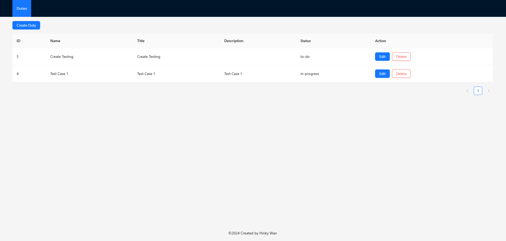

# nexplore-technical-test

This technical test aims to create an end-to-end web application that allows the user to read, create, and update a to-do list of duties of any kind.



## Table of Contents

- [Deploy To Production](#deploy-to-production)
- [Project Structure](#project-structure)

## Deploy To Production

1. Clone the repository:

    ```sh
    git clone https://github.com/Hinkywan/nexplore-technical-test.git
    ```

2. Set up the environment variables for the Backend project. Create a `.env` file in the root directory and add the following variables:
    
    ```sh
    cd ./backend/
    ```

    ```env
    DB_USER=your_db_user
    DB_HOST=your_db_host
    DB_NAME=your_db_name
    DB_PASSWORD=your_db_password
    DB_PORT=5432
    
    PORT=4000
    CORS_ORIGIN=http://localhost:3000
    ```

3. Start the Docker containers:

    ```sh
    docker-compose up -d
    ```

    This will start the PostgreSQL database and any other services defined in the `docker-compose.yml` file.

4. Set up the environment variables for the Frontend project. Create a `.env` file in the `frontend` directory and add the following variables:

    ```env
    REACT_APP_ENV=production

    REACT_APP_API_URL=http://localhost:4000/api
    REACT_APP_CORS_ORIGIN=http://localhost:3000
    ```

5. Navigate back to the root directory and start the application:

    ```sh
    cd ..
    npm run start
    ```

    This will start both the backend and frontend servers.

## Project Structure

The project structure is as follows:

```
nexplore-technical-test/
│
├── backend/
│   ├── src/
│   │   ├── app.ts
│   │   ├── config/
│   │   ├── controllers/
│   │   ├── entity/
│   │   ├── interfaces/
│   │   ├── middlewares/
│   │   ├── models/
│   │   ├── routes/
│   │   ├── services/
│   │   └── utils/
│   ├── migrations/
│   ├── scripts/
│   ├── tests/
│   │   ├── controllers/
│   │   ├── models/
│   │   └── services/
│   ├── .env
│   ├── .env.example
│   ├── .gitignore
│   ├── package.json
│   ├── package-lock.json
│   ├── docker-compose.yml
│   ├── README.md
│   └── tsconfig.json
│
├── frontend/
│   ├── public/
│   │   ├── index.html
│   │   └── ...
│   ├── src/
│   │   ├── assets/
│   │   ├── components/
│   │   ├── hooks/
│   │   ├── pages/
│   │   ├── services/
│   │   ├── App.tsx
│   │   ├── index.tsx
│   │   └── ...
│   ├── package.json
│   ├── tsconfig.json
│   └── ...
│
├── docker-compose.yml
└── README.md
```